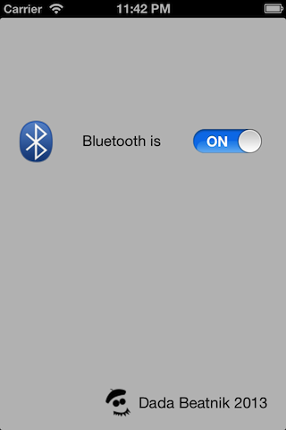

# BluetoothAche
## Very quickly turn on/off Bluetooth on your iPhone

A simple app for iPhone that very quickly turns Bluetooth on or off, rather than having to go through the Settings app. It demonstrates using one of Apple's private frameworks (BluetoothManager.framework).

->  <-

Note the private methods declared in ViewController.m:

    @interface BluetoothManager : NSObject

    + (id)sharedInstance;
    - (BOOL)setEnabled:(BOOL)enabled;
    - (BOOL)enabled;
    - (BOOL)setPowered:(BOOL)powered;

    @end

There are more methods, you can find these [here](https://github.com/nst/iOS-Runtime-Headers/blob/master/PrivateFrameworks/BluetoothManager.framework/BluetoothManager.h)

This will never be allowed on the App Store as it references a private framework, thus it is for educational purposes only.

***
[Dada Beatnik](http://www.dadabeatnik.com)
